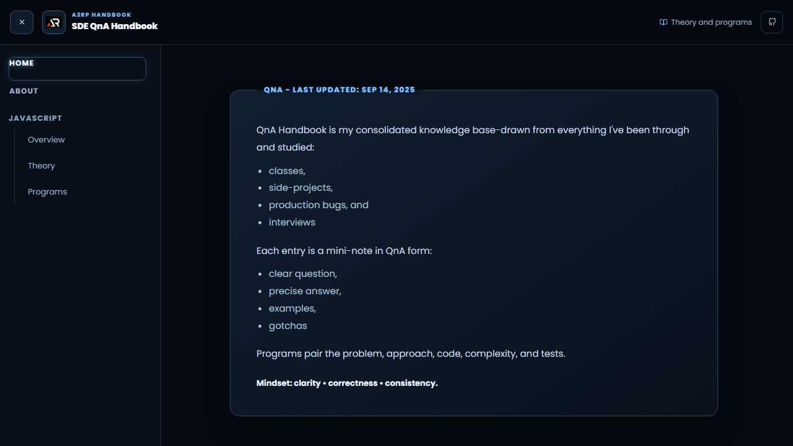

# SDE QnA Handbook

A practical revision handbook for software development interview theory and programs.

## Features

- Question-and-answer notes for JavaScript, React, and Node
- Dedicated theory and programs routes with code-focused explanations
- Fixed handbook navigation with active route highlighting
- Responsive layout, icon footer links, and route-aware scrolling

## Tech stack

React, Vite, JavaScript, React Router, styled-components, Material UI, and react-icons.

## Run locally

```bash
npm install
npm run dev
```

Create a production build with `npm run build`. Deploy to GitHub Pages with `npm run deploy`.

## Live

[Open the SDE QnA Handbook](https://a2rp.github.io/sde-qna-handbook/)



## Links

- [Portfolio](https://www.ashishranjan.net/)
- [GitHub](https://github.com/a2rp)
- [CodePen](https://codepen.io/ash1198)
- [LinkedIn](https://www.linkedin.com/in/aashishranjan)
- [Facebook](https://www.facebook.com/theash.ashish/)
- [YouTube](https://www.youtube.com/@ashishranjan-ashz?sub_confirmation=1)
- [Email](mailto:ash.ranjan09@gmail.com)

## Support

- [Support](https://a2rp-donation-page.netlify.app/)
- [Buy Me a Coffee](https://buymeacoffee.com/a2rp)
- [Patreon](https://patreon.com/a2rp)
